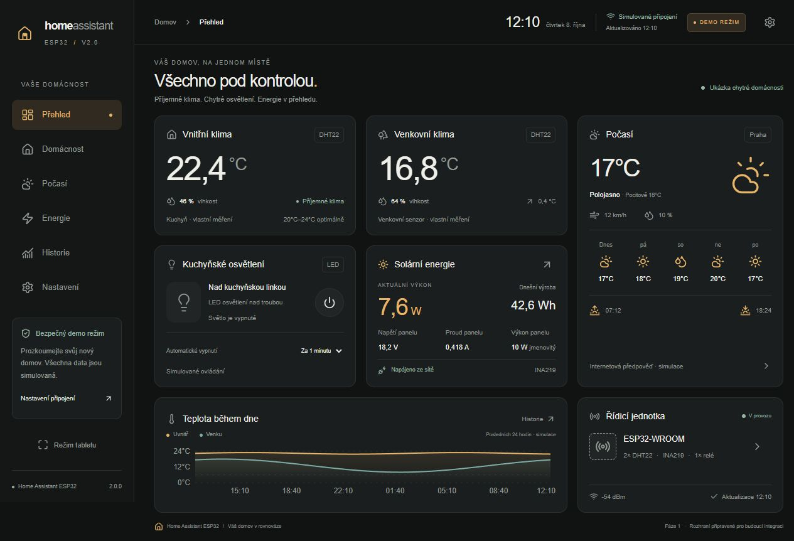

# Home Assistant ESP32 v2.0

České tabletové rozhraní pro přehled domácnosti, klima, kuchyňské světlo a solární energii. **Fáze 1 je pouze frontend.** Repozitář neobsahuje firmware, zapojení GPIO ani skutečné ovládání relé.



## Spuštění

Použijte Node.js 22 LTS nebo novější podporovanou verzi a npm.

```sh
npm install
npm run dev
```

Otevřete [http://localhost:3000](http://localhost:3000). Na Windows lze při omezení PowerShell skriptů použít `npm.cmd`.

Produkční spuštění:

```sh
npm run build
npm start
```

Volitelně zkopírujte `.env.example` do `.env.local` a nastavte `NEXT_PUBLIC_ESP32_API_URL`. Stejnou veřejnou adresu lze uložit v Nastavení. Proměnná ani nastavení nesmí obsahovat přihlašovací údaje. Nastavení v prohlížeči má přednost před výchozí proměnnou. Aplikace nepotřebuje databázi, Railway ani externí účet; písma a ikony nenačítá z CDN.

## Hotové funkce

| Stránka                | Obsah                                                                                                                       |
| ---------------------- | --------------------------------------------------------------------------------------------------------------------------- |
| Přehled `/`            | Klima uvnitř a venku, počasí, světlo, solární výkon, mini historie, stav jednotky, čas a poslední aktualizace               |
| Domácnost `/domacnost` | DHT22 senzory, rozdíly, minima a maxima, teplota a vlhkost v čase, ovládání světla                                          |
| Počasí `/pocasi`       | Simulované aktuální počasí, hodinový výhled a graf, sedm dní, déšť, vítr, nárazy, tlak, východ a západ slunce               |
| Energie `/energie`     | Panel, INA219, AGM baterie, dostupnost zdrojů, denní a týdenní grafy, plánovaný tok energie včetně samostatné větve tabletu |
| Historie `/historie`   | Výběr veličiny a období 1 h / 24 h / 7 dní / 30 dní, interaktivní grafy a prázdné stavy                                     |
| Nastavení `/nastaveni` | Vzhled, kiosk, ztlumení, šetřič, jednotky, poloha, interval, API, diagnostika a verze                                       |

- Tmavý a světlý vzhled; responzivní mřížka a mobilní spodní navigace.
- České číselné formátování, datum, 24hodinový čas v zóně Europe/Prague.
- Potvrzený stav demo světla až po asynchronní odezvě, průběžný stav a chybová větev.
- Demo časovač 1 / 5 / 15 / 30 minut přetrvává při změně stránky i obnovení aplikace. Platí pouze pro simulaci; zavřený prohlížeč neovládá žádné zařízení.
- Synchronizace demo relé mezi kartami stejného původu pomocí BroadcastChannel, pravidelná obnova dat a přepnutí režimu mezi kartami pomocí události úložiště.
- Lokální uložení nesenzitivních preferencí; při blokovaném úložišti fungují v paměti.
- Klávesové ovládání, viditelný fokus, popisky ovladačů, přístupný dialog Radix/shadcn a respektování omezeného pohybu.

## Demo a živý režim

Při prvním spuštění je aktivní **DEMO REŽIM**, trvale označený v záhlaví. Všechna demo měření, počasí a stavy napájení jsou simulované. Demo provider je jediným zdrojem ukázkových měření.

Přechod do **ŽIVÉHO REŽIMU** má potvrzovací dialog. Aplikace neposkytuje demo náhradu za neúspěšné API. Chyba spojení skryje předchozí měření, zobrazí vysvětlení a nabídne opakování. Neznámé hodnoty mají stav „Nedostupné“.

Čtení senzoru používá `GET {endpoint}/status`, timeout 6 sekund, bez cache a bez přihlašovacích údajů. Endpoint musí vrátit JSON s aktuálním časem ISO 8601, například v tomto tvaru; uvedené hodnoty jsou pouze ilustrace kontraktu:

```json
{
  "device": { "connected": true, "lastUpdate": "2026-10-08T10:00:00.000Z" },
  "indoor": { "temperature": 22.4, "humidity": 46 },
  "outdoor": { "temperature": 16.8, "humidity": 64 },
  "solar": {
    "power": 7.6,
    "voltage": 18.2,
    "current": 0.418,
    "dailyEnergy": null
  },
  "relay": { "on": false, "acknowledgedAt": null }
}
```

Při implementaci endpointu nahraďte ukázkový čas aktuálním časem měření. Odpovědi starší než dvě minuty, neplatný JSON a neplatný stav zařízení se odmítají. Chybějící a nečíselné hodnoty se převedou na `null`. Současný adaptér přijímá pouze stávající senzory a stav relé; budoucí baterii, zdroje, počasí a historii z této odpovědi nepřebírá. Pokud API běží na jiném původu, musí budoucí server povolit příslušné CORS. HTTPS stránka nemůže běžně načítat HTTP API; pro produkční instalaci počítejte s odpovídající zabezpečenou bránou.

**Živé ovládání relé zůstává zakázané i po zadání adresy API.** V této fázi není implementován autentizovaný zapisovací endpoint. Budoucí adaptér musí ověřovat potvrzení konkrétního příkazu, řešit timeout a pravidelně synchronizovat potvrzený stav s ostatními klienty. Komponenty mohou nadále používat společný hook `useRelay`; nesmějí přidávat vlastní přímé požadavky na ESP32.

## Architektura

- `src/app/`: App Router, šest skutečných cest, společný layout, česká metadata a ikona.
- `src/types/`: typované kontrakty senzorů, počasí, historie, diagnostiky a preferencí.
- `src/services/data.ts`: oddělené funkce demo provideru a živého adaptéru, validace, timeout a simulace relé.
- `src/hooks/use-home.tsx`: TanStack Query, kontext preferencí, obnova a oddělené klíče cache podle režimu, endpointu a období.
- `src/components/dashboard/`: znovupoužitelné karty a přehled.
- `src/components/charts/`, `src/components/weather/`: responzivní grafy Recharts.
- `src/components/ui/`: lokální komponenty ve stylu shadcn/ui, Radix dialog a variantní Button; konfigurace v `components.json`.
- `src/components/app-shell.tsx`: navigace, záhlaví, kiosk a šetřič.
- `src/components/settings-panel.tsx`: nastavení a validace uživatelských vstupů.
- `src/app/globals.css`: vlastní design systém, Tailwind CSS 4 a responzivní styly.

Komponenty neprovádějí požadavky na zařízení. API lze později rozšířit ve službách bez přestavby obrazovek. Historie je zatím v paměti demo provideru, není uchovávána v databázi.

## Režim tabletu

Tlačítko „Režim tabletu“ aktivuje rozložení bez postranní navigace a pokusí se otevřít fullscreen. Při zamítnutí prohlížečem funguje rozložení dál a zobrazí vysvětlení. Tlačítko pro ukončení zůstává dostupné. Ztlumení je pouze vizuální filtr stránky, nikoliv systémový jas. Volitelný šetřič se zapne po dvou minutách nečinnosti, má pohybující se obsah a lze jej zavřít dotykem nebo Escape. Nelze zaručit ochranu proti vypálení ani zabránění uspání Androidu; to vyžaduje nastavení zařízení.

## Ověření

```sh
npm run lint
npm run typecheck
npm test
npm run build
```

Osm testů ověřuje prázdný živý stav, oddělení dat, nepodporovaný hardware, zastaralé odpovědi, bezpečný formát adresy, období historie, potvrzení relé a chyby živých požadavků. Automatická kontrola na GitHubu spouští stejné kroky.

Ruční prohlížečová kontrola a rozsah ověření jsou v [docs/VALIDACE.md](docs/VALIDACE.md). Snímky obsahují výhradně simulované hodnoty nebo nepřipojený živý stav:

- [Tmavý tablet](docs/screenshots/dark-tablet.jpg)
- [Světlý tablet](docs/screenshots/light-tablet.jpg)
- [Telefon](docs/screenshots/mobile-overview.jpg)
- [Živý režim bez zařízení](docs/screenshots/live-unavailable.jpg)

## Integrace pro další fázi

- Skutečný ESP32 firmware, čtecí API, autentizace a potvrzované příkazy relé.
- Open-Meteo a geokódování uložené polohy.
- Uložení historie, skutečná denní výroba a serverová synchronizace klientů.
- Měření proudu a napětí baterie, dostupnosti sítě a aktivního zdroje.
- Instalace objednaného TPS2116 a ověření hybridního systému i samostatného napájení tabletu.
- Diagnostika a bezpečný mechanismus aktualizace firmwaru.

TPS2116 není prezentován jako instalovaný. Stav nabití se nepočítá z jediného napětí; procento nabití je bez potřebného měření vždy nedostupné. Spotřeba ESP32 se nevydává za naměřenou ani odhadnutou. Žádná z těchto integrací není v této fázi skutečně provozována.
