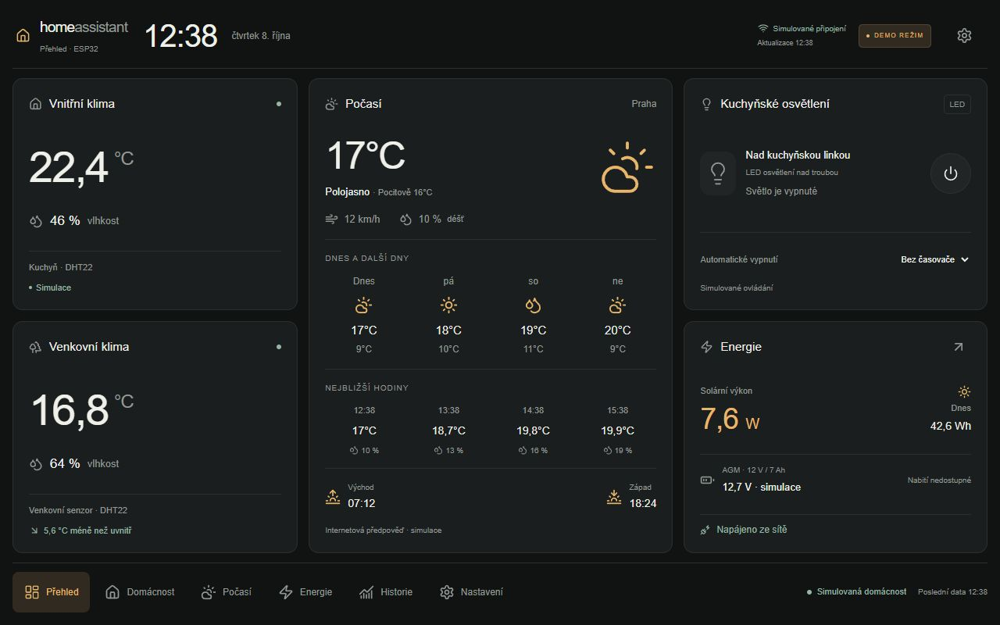

# Home Assistant ESP32 v2.0

České tabletové rozhraní pro přehled domácnosti, klima, kuchyňské světlo a solární energii. **Fáze 1 je pouze frontend.** Repozitář neobsahuje firmware, zapojení GPIO ani skutečné ovládání relé.



## Spuštění

Použijte Node.js 22 LTS nebo novější podporovanou verzi a npm.

```sh
npm install
npm run dev
```

Otevřete [http://localhost:3000](http://localhost:3000). Na Windows lze při omezení PowerShell skriptů použít `npm.cmd`.

Produkční spuštění:

```sh
npm run build
npm start
```

Volitelně zkopírujte `.env.example` do `.env.local` a nastavte `NEXT_PUBLIC_ESP32_API_URL`. Stejnou veřejnou adresu lze uložit v Nastavení. Proměnná ani nastavení nesmí obsahovat přihlašovací údaje. Nastavení v prohlížeči má přednost před výchozí proměnnou. Aplikace nepotřebuje databázi, Railway ani externí účet; písma a ikony nenačítá z CDN.

## Hotové funkce

| Stránka                | Obsah                                                                                                                       |
| ---------------------- | --------------------------------------------------------------------------------------------------------------------------- |
| Přehled `/`            | Jedna obrazovka na šířku: klima, aktuální/denní/hodinové počasí, světlo, solární výkon, baterie, zdroj, čas a navigace      |
| Domácnost `/domacnost` | DHT22 senzory, rozdíly, minima a maxima, teplota a vlhkost v čase, ovládání světla                                          |
| Počasí `/pocasi`       | Simulované aktuální počasí, hodinový výhled a graf, sedm dní, déšť, vítr, nárazy, tlak, východ a západ slunce               |
| Energie `/energie`     | Panel, INA219, AGM baterie, dostupnost zdrojů, denní a týdenní grafy, plánovaný tok energie včetně samostatné větve tabletu |
| Historie `/historie`   | Výběr veličiny a období 1 h / 24 h / 7 dní / 30 dní, interaktivní grafy a prázdné stavy                                     |
| Nastavení `/nastaveni` | Vzhled, kiosk, ztlumení, šetřič, jednotky, poloha, interval, API, diagnostika a verze                                       |

- Tmavý a světlý vzhled; responzivní mřížka a mobilní spodní navigace.
- České číselné formátování, datum, 24hodinový čas v zóně Europe/Prague.
- Potvrzený stav demo světla až po asynchronní odezvě, průběžný stav a chybová větev.
- Demo časovač 1 / 5 / 15 / 30 minut přetrvává při změně stránky i obnovení aplikace. Platí pouze pro simulaci; zavřený prohlížeč neovládá žádné zařízení.
- Synchronizace demo relé mezi kartami stejného původu pomocí BroadcastChannel, pravidelná obnova dat a přepnutí režimu mezi kartami pomocí události úložiště.
- Lokální uložení nesenzitivních preferencí; při blokovaném úložišti fungují v paměti.
- Klávesové ovládání, viditelný fokus, popisky ovladačů, přístupný dialog Radix/shadcn a respektování omezeného pohybu.

## Demo a živý režim

Při prvním spuštění je aktivní **DEMO REŽIM**, trvale označený v záhlaví. Všechna demo měření, počasí a stavy napájení jsou simulované. Demo provider je jediným zdrojem ukázkových měření.

Přechod do **ŽIVÉHO REŽIMU** má potvrzovací dialog. Aplikace neposkytuje demo náhradu za neúspěšné API. Chyba spojení skryje předchozí měření, zobrazí vysvětlení a nabídne opakování. Neznámé hodnoty mají stav „Nedostupné“.

Čtení senzoru používá `GET {endpoint}/status`, timeout 6 sekund, bez cache a bez přihlašovacích údajů. Endpoint musí vrátit JSON s aktuálním časem ISO 8601, například v tomto tvaru; uvedené hodnoty jsou pouze ilustrace kontraktu:

```json
{
  "device": { "connected": true, "lastUpdate": "2026-10-08T10:00:00.000Z" },
  "indoor": { "temperature": 22.4, "humidity": 46 },
  "outdoor": { "temperature": 16.8, "humidity": 64 },
  "solar": {
    "power": 7.6,
    "voltage": 18.2,
    "current": 0.418,
    "dailyEnergy": null
  },
  "relay": { "on": false, "acknowledgedAt": null }
}
```

Při implementaci endpointu nahraďte ukázkový čas aktuálním časem měření. Odpovědi starší než dvě minuty, neplatný JSON a neplatný stav zařízení se odmítají. Chybějící a nečíselné hodnoty se převedou na `null`. Současný adaptér přijímá pouze stávající senzory a stav relé; budoucí baterii, zdroje, počasí a historii z této odpovědi nepřebírá. Pokud API běží na jiném původu, musí budoucí server povolit příslušné CORS. HTTPS stránka nemůže běžně načítat HTTP API; pro produkční instalaci počítejte s odpovídající zabezpečenou bránou.

**Živé ovládání relé zůstává zakázané i po zadání adresy API.** V této fázi není implementován autentizovaný zapisovací endpoint. Budoucí adaptér musí ověřovat potvrzení konkrétního příkazu, řešit timeout a pravidelně synchronizovat potvrzený stav s ostatními klienty. Komponenty mohou nadále používat společný hook `useRelay`; nesmějí přidávat vlastní přímé požadavky na ESP32.

## Architektura

- `src/app/`: App Router, šest skutečných cest, společný layout, česká metadata a ikona.
- `src/types/`: typované kontrakty senzorů, počasí, historie, diagnostiky a preferencí.
- `src/services/data.ts`: oddělené funkce demo provideru a živého adaptéru, validace, timeout a simulace relé.
- `src/hooks/use-home.tsx`: TanStack Query, kontext preferencí, obnova a oddělené klíče cache podle režimu, endpointu a období.
- `src/components/dashboard/`: znovupoužitelné karty a přehled.
- `src/components/charts/`, `src/components/weather/`: responzivní grafy Recharts.
- `src/components/ui/`: lokální komponenty ve stylu shadcn/ui, Radix dialog a variantní Button; konfigurace v `components.json`.
- `src/components/app-shell.tsx`: navigace, záhlaví, kiosk a šetřič.
- `src/components/settings-panel.tsx`: nastavení a validace uživatelských vstupů.
- `src/app/globals.css`: vlastní design systém, Tailwind CSS 4 a responzivní styly.

Komponenty neprovádějí požadavky na zařízení. API lze později rozšířit ve službách bez přestavby obrazovek. Historie je zatím v paměti demo provideru, není uchovávána v databázi.

## Režim tabletu

Přehled na šířku má pevnou výšku dostupného viewportu a tři oblasti CSS Grid. Ostatní stránky mohou posouvat obsah. V nastavení je samostatný „Tabletový režim“: okraj 0–40 px (výchozí 16), měřítko 90–115 %, tlačítka 48/52/56 px, prohození levé a pravé strany, preference orientace, fullscreen, noční plán, ztlumení a hodinový šetřič. Preference se ukládají místně v prohlížeči. Při malé dostupné výšce se zkrátí doplňkové popisky; časovač světla je nadále na stránce Domácnost.

Noční plán používá časovou zónu Europe/Prague, podporuje interval přes půlnoc a přepne na tmavé ztlumené barvy. Stejný začátek a konec plán vypne. Automatické ztlumení má volitelnou prodlevu 30 s / 1 / 2 / 5 min; hodinový šetřič 2 / 5 / 10 min. První dotyk nebo klávesa probudí panel a neaktivuje ovládání pod překryvem. Omezení animací vypne i pohyb hodin. Ztlumení je pouze vzhled stránky; nemění hardwarový jas a nezaručuje ochranu proti vypálení.

## Instalace na tablet do 3D tištěného rámečku

1. Spusťte produkční sestavení na trvale dostupném serveru (`npm run build`, `npm start`). Na tabletu otevřete jeho **HTTPS adresu s platným certifikátem**. `localhost` je výjimka pro testování na stejném zařízení; HTTP adresa počítače v domácí síti není pro PWA rovnocenná localhostu. Použijte aktuální Chrome nebo kompatibilní Android prohlížeč.
2. Nechte první načtení dokončit při dostupné síti. Nabídkou prohlížeče „Nainstalovat aplikaci“ / „Přidat na plochu“ nainstalujte PWA a spusťte ji z ikony. Manifest má režim `standalone`, orientaci `landscape`, barvu motivu a ikony 192/512 px včetně maskovatelné. Dostupnost instalace závisí na prohlížeči; viz [podmínky instalovatelnosti PWA](https://developer.mozilla.org/en-US/docs/Web/Progressive_web_apps/Guides/Making_PWAs_installable).
3. V Nastavení → Tabletový režim začněte s okrajem **16 CSS px**, měřítkem 100 % a tlačítky 52 px. Nasaďte rámeček a ověřte prstem horní nastavení, spodní navigaci i světlo. Podle skutečného překrytí zvětšete okraj; systémové safe-area insets se přičítají. Rozhodují dostupné CSS pixely, nikoli fyzické rozlišení displeje. Změna systémové velikosti zobrazení může změnit dostupný prostor.
4. Klepnutím na „Celá obrazovka“ nebo „Režim tabletu“ vyvolejte Fullscreen API. Orientaci se aplikace pokusí zamknout jen při této akci. Při odmítnutí zobrazí vysvětlení a zůstane funkční. Orientaci nastavte také v Androidu nebo kiosk aplikaci. Fullscreen je dočasný a po znovuotevření může vyžadovat další dotyk.

**PWA sama Android nezamyká a nezajišťuje automatický start po restartu.** Pro trvalý panel použijte kiosk prohlížeč, například [Fully Kiosk Browser a jeho oficiální návod](https://www.fully-kiosk.com/en/). Nastavte adresu této aplikace jako Start URL, spuštění po bootu, orientaci na šířku, skrytí adresního řádku a podporovaných systémových lišt, zákaz přepínání aplikací a vlastní způsob ukončení kiosku s PIN. Nastavte zachování zapnutého displeje a obnovu stránky při návratu sítě nebo chybě načtení. Konkrétní volby, oprávnění a případná placená licence závisí na zařízení a verzi kiosk softwaru. Globální zákaz posouvání nezapínejte: vedlejší stránky jej potřebují. Automatické mazání webového úložiště/cache by odstranilo preference a offline shell.

Pro spravovaný tablet lze použít podporované řešení **Android Enterprise device owner** s povolenou kiosk aplikací a **lock task mode**. Správce nastavuje povolené aplikace, systémové ovládání a spuštění kiosku; obyčejné připnutí obrazovky neposkytuje stejnou ochranu. Postup správy a dostupné systémové funkce popisuje [Android lock task mode](https://developer.android.com/work/dpc/dedicated-devices/lock-task-mode). Provisioning může vyžadovat přípravu či reset zařízení; tento frontend správu Androidu neprovádí.

V Androidu nastavte přiměřený **hardwarový jas**, dobu zhasnutí obrazovky a podle podporovaných možností výjimku pro úsporu energie kiosk aplikace. Ověřte probuzení po restartu i po přerušení napájení. Webová vrstva neslibuje spolehlivé zabránění uspání na každém Androidu; fyzicky zhasnutý displej samotný webový dotykový překryv neprobudí. Zvolte jeden hlavní plán uspávání/probouzení v Androidu nebo kiosku a sladěte jej s nočním plánem aplikace.

**Offline a obnova spojení:** service worker ukládá stránky a jejich místní statické soubory, nikoli ESP32 API, živá měření ani zapisovací požadavky. Po prvním úspěšném načtení může zobrazit rozhraní i při výpadku serveru. Browser offline stav nebo chyba/stáří API skryje živé hodnoty. Uloží se pouze čas posledního úspěšného měření, odděleně pro režim a endpoint; přežije obnovení stránky. Dotazy se opakují ve zvoleném intervalu a při návratu připojení. Demo zůstává viditelně označenou simulací i offline. Cache může Android/prohlížeč odstranit, proto ji nepovažujte za náhradu spolehlivého serveru.

Po nové verzi se offline shell uloží do nové cache; čekající service worker se aktivuje po zavření všech oken této aplikace. Pro aktualizaci ukončete její PWA/kiosk okna a znovu otevřete stránku online. Před montáží prakticky vyzkoušejte restart tabletu, ztrátu Wi-Fi, obnovení stránky bez serveru, návrat API, noční plán a první dotyk po ztlumení. Automatický start, systémové lišty a dlouhodobý provoz je nutné ověřit na konkrétním tabletu.

## Ověření

```sh
npm run lint
npm run typecheck
npm test
npm run build
```

Čtrnáct testů ověřuje datovou vrstvu, potvrzení demo relé, noční intervaly, validaci tabletových preferencí, stáří měření, offline fallback, oddělení API od cache a vytvoření spustitelného service workeru. Automatická kontrola na GitHubu spouští stejné kroky.

Ruční prohlížečová kontrola a rozsah ověření jsou v [docs/VALIDACE.md](docs/VALIDACE.md). Snímky obsahují výhradně simulované hodnoty nebo nepřipojený živý stav:

- [1024 × 600](docs/screenshots/kiosk-1024x600.jpg)
- [1280 × 800](docs/screenshots/kiosk-1280x800.jpg)
- [1920 × 1200](docs/screenshots/kiosk-1920x1200.jpg)
- [Portrét 800 × 1280](docs/screenshots/kiosk-800x1280.jpg)
- [Světlý tablet](docs/screenshots/light-tablet.jpg)
- [Telefon](docs/screenshots/mobile-overview.jpg)
- [Živý režim bez zařízení](docs/screenshots/live-unavailable.jpg)

## Integrace pro další fázi

- Skutečný ESP32 firmware, čtecí API, autentizace a potvrzované příkazy relé.
- Open-Meteo a geokódování uložené polohy.
- Uložení historie, skutečná denní výroba a serverová synchronizace klientů.
- Měření proudu a napětí baterie, dostupnosti sítě a aktivního zdroje.
- Instalace objednaného TPS2116 a ověření hybridního systému i samostatného napájení tabletu.
- Diagnostika a bezpečný mechanismus aktualizace firmwaru.

TPS2116 není prezentován jako instalovaný. Stav nabití se nepočítá z jediného napětí; procento nabití je bez potřebného měření vždy nedostupné. Spotřeba ESP32 se nevydává za naměřenou ani odhadnutou. Žádná z těchto integrací není v této fázi skutečně provozována.
