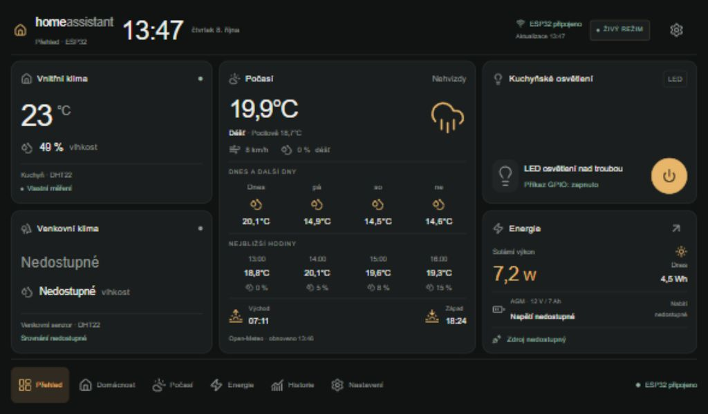
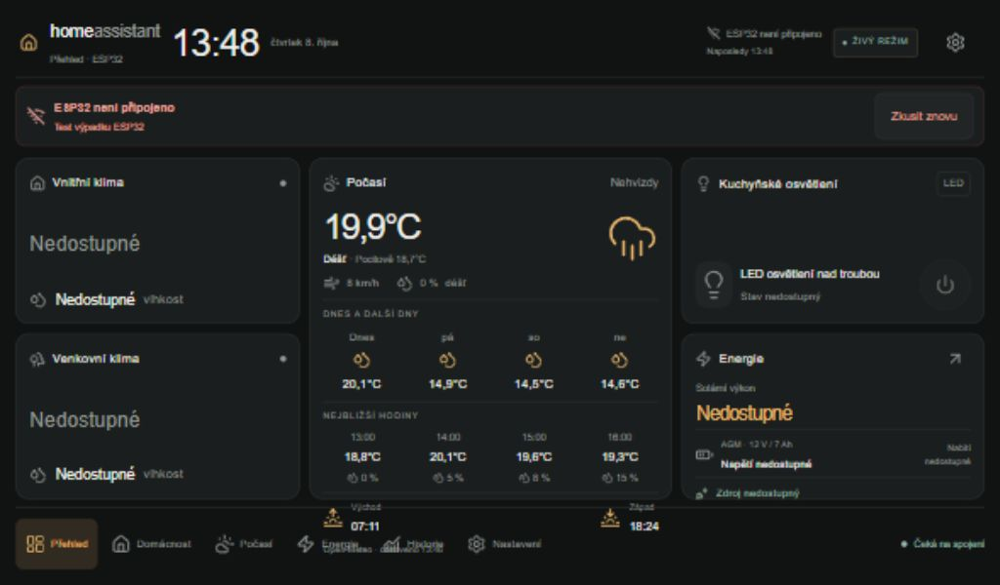

# Ověření fáze 2

8. října 2026, Windows. **Bez fyzického ESP32, bez flashování a bez přepínání skutečných relé nebo zdrojů.** Původní .ino i stará Node aplikace byly prohlédnuty mimo repozitář a zůstaly nezměněné.

| Kontrola | Výsledek |
|---|---|
|Arduino CLI 1.5.0 / ESP32 core 3.3.8 / ESP32 Dev Module|Úspěšně; stejný sketch, který otevírá Arduino IDE|
|Arduino výchozí sestavení|Flash 1 116 954 / 1 310 720 B (85 %), RAM 78 716 / 327 680 B (24 %)|
|PlatformIO 6.1.19 / espressif32 7.1.3 / Arduino 2.0.17|Úspěšně, společný .ino a stejné moduly|
|PlatformIO výchozí sestavení|Flash 953 841 / 1 310 720 B (72,8 %), RAM 75 288 / 327 680 B (23 %)|
|PlatformIO s výslovně testovacími Wi-Fi/API/OTA údaji, tlačítkem, TPS a potvrzeným směrem INA|Úspěšně, flash 970 645 B, RAM 77 488 B; nastavení poté odstraněna a výchozí projekt znovu sestaven|
|LittleFS obraz|Úspěšně vytvořen, nenahrán|
|Nativní C++ / skutečná sdílená logika + ArduinoJson|Úspěšně|
|Frontend ESLint + TypeScript|Úspěšně|
|Automatické webové testy|21 / 21 úspěšných|
|Produkční Next.js 16.4 sestavení|Úspěšně; šest stránek + serverové brány/session/počasí|
|Skutečné Open-Meteo pro Nehvizdy|Aktuální počasí, 24 hodin a 7 dní úspěšně načteny přes ověřované HTTPS|

Arduino knihovny byly ověřeny v instalovaném IDE: ArduinoJson 7.4.3, DHT sensor library 1.4.7, INA219 1.2.3, Unified Sensor 1.1.15 a BusIO 1.17.4. CI sestavuje web, PlatformIO i Arduino sketch.

C++ testy: selhání/stáří čidel, null JSON, rozsahy, mV/mA/W, podepsaná integrace Wh, půlnoc, časové mezery, reboot, zachování celkového součtu, nezávislé relé, CAS/idempotence, 500ms ochrana přepínání, validace příkazu, ST a autentizační porovnání. Webové testy: session/expirace/podvržení, Origin, omezení těla, povolené oba kanály relé, žádný klíč/cookie v odpovědi pro browser, chyby/offline, párování potvrzení, rychlé dotyky, podepsané solární údaje, počasí/keš/souběh/expirace a offline shell.

V produkčním browseru s místním **testovacím ESP32 API**: přihlášení, Demo → Live, vnitřní senzor dostupný / venkovní nedostupný, baterie nedostupná, POST relays/1, zakázaný ovladač během čekání a potvrzený GPIO stav. Ověřeny obrazovky Domácnost, Počasí, Energie, Historie a Nastavení. Historie zobrazila testovací restart s uptime bez vymyšleného data. Při výpadku 503 se místní údaje skryly, relé zakázalo a skutečná nezávislá předpověď zůstala dostupná. Dřívější průběžné kontroly stejné živé vrstvy ověřily synchronizaci dvou karet, cizí změnu dotazováním, konflikt 409 a automatický návrat připojení.

Přehled s naplněnou předpovědí bez posouvání: 1024×600, 1280×800 a 1920×1200. Při výpadku API také 1024×600 bez posouvání. Portrét 800×1280 dovoluje svislé posouvání bez vodorovného přetečení. Nové relé má přesný název LED osvětlení nad troubou.

Snímky obsahují **testovací lokální senzorové/relé hodnoty a skutečné internetové počasí**, nikoli měření fyzického ESP32:

Zbývá [fyzický kontrolní seznam](TROUBLESHOOTING.md): boot/reset a kontakty obou relé, nové GPIO17/32 na konkrétní desce, DHT a pull-upy, INA kalibrace/poloha/směr, dlouhodobá síť/flash, skutečné OTA, AGM ochrany/DC/DC/TPS a Android kiosk. Kompilace tyto vlastnosti nepotvrzuje.
